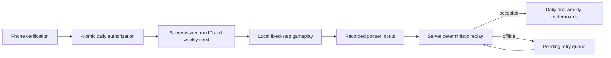

# SLIP

**A mobile-first daily survival game where every competitive run must be earned, recorded, and verified.**

SLIP is an active MVP for a high-score arcade platform. A verified phone number receives one competitive attempt per UTC day. The client records input rather than submitting a trusted score; the server replays that input against the same deterministic course before publishing the result.

The repository includes an unlimited `/demo` mode, so the game can be evaluated locally without Twilio credentials or consuming an attempt.

> Development status: the game loop, backend rules, and leaderboard model are implemented and tested locally. Production SMS credentials, infrastructure, privacy controls, and broad physical-device testing remain before a public beta. No prizes or cash payouts are offered.

## Gameplay

- Hold the start circle through a three-second countdown, then drag continuously.
- Lifting the pointer or touching a hazard ends the run.
- Survive for 100 points per second; optional gold tokens add 250 points and require riskier movement.
- Face angled retracting gates, moving bars, orbiting shapes, pendulums, pinwheels, tracking turrets, tunnels, and switchback mazes.
- Enter a faster themed section every 5,000 points.
- Play inside the same 360 × 640 logical field on every screen size.

The simulation runs at a fixed 120 Hz and the canvas renders independently with interpolated timestamps. Pointer samples are coalesced when the browser provides them. Swept collisions check the full movement path, including rotating geometry and high-speed projectiles.

## Competitive architecture



- **Authentication:** Twilio Verify sends SMS codes. A keyed phone digest maps each verified number to a persistent internal player ID; phone numbers never appear on leaderboards.
- **Attempt enforcement:** D1 uniqueness constraints and transactions limit each user to one run per game and UTC day. Idempotency keys make repeated start and submit requests safe.
- **Score integrity:** The server ignores client-supplied scores and reconstructs survival time, token pickups, collisions, and movement limits from the versioned run configuration and compressed input trace.
- **Leaderboards:** Today uses the verified daily score. This Week uses each player's highest verified daily result during the Monday-Sunday UTC week. Equal scores share a rank.
- **Resilience:** Gameplay has no leaderboard or network work in its animation loop. Interrupted connectivity queues submission, and a started run remains consumed across sessions and devices.
- **History:** Runs keep their start day and week even across midnight. Closed periods are finalized after retry deadlines and retained as immutable standings.

## Stack

| Area | Technology |
| --- | --- |
| UI | React 19, TypeScript, canvas, Tailwind CSS |
| App framework | Vinext / Next-compatible App Router on Vite |
| Runtime | Cloudflare Workers |
| Database | Cloudflare D1, SQLite, Drizzle ORM |
| Phone verification | Twilio Verify |
| Validation | Versioned deterministic simulation and replay verification |
| Quality | Node test runner, TypeScript, GitHub Actions |

## Run locally

Requirements: Node.js 24 or a compatible Node release satisfying `>=22.13.0`.

```bash
npm ci
npm run dev
```

Open [http://localhost:5173/demo](http://localhost:5173/demo) for unlimited unranked play. The authenticated flow at `/` requires Twilio and database configuration.

For the first local database-backed run, build and apply the migration:

```bash
npm run build
node --import ./scripts/sites-env.mjs ./node_modules/wrangler/bin/wrangler.js d1 execute DB --local --config dist/server/wrangler.json --persist-to .wrangler/state --file drizzle/0000_sour_dakota_north.sql
```

Copy the variable names from `.env.example` into an ignored local environment file or your host's encrypted secret store. Never commit real credentials. `PHONE_HASH_SECRET` must be random and stable across deployments.

## Verification

```bash
npm run typecheck
npm test
npm run build
```

The deterministic engine suites cover version compatibility, replay agreement, collision geometry, gates, shooters, tunnels, themes, difficulty stages, and invalid movement. An additional integration script validates authentication rejection, concurrent attempt idempotency, one-run-per-day enforcement, immutable score submission, tied ranks, weekly maximums, persistence, history, and period finalization against the local Wrangler database:

```bash
# Run only while the local app and local D1 database are active.
node tests/integration.ts
```

The integration script creates and removes temporary fixtures. It is intentionally not a production test command.

## Repository map

- `app/game.tsx` - canvas lifecycle, pointer capture, countdown, result state, and offline submission queue
- `lib/engine-v6.ts` - current fixed-step simulation, collisions, replay encoding, and server validation
- `lib/course-v6.ts` - deterministic obstacle scenes, themes, and token placement
- `lib/engine-v1.ts` through `lib/engine-v5.ts` - compatibility for historical server-issued configurations
- `app/api/` - SMS verification, sessions, attempts, submissions, status, history, and leaderboards
- `db/schema.ts` and `drizzle/` - persistent accounts, rate limits, runs, period archives, and standings
- `tests/` - deterministic engine and local API integration checks

See [ROADMAP.md](ROADMAP.md) for the beta checklist and longer-term direction.

## Security scope

Replay validation prevents a client from claiming an arbitrary score, but it cannot prove that a human generated a valid input path. Stronger anti-automation and device-attestation controls would be required before any valuable competition. SMS verification limits attempts per phone number; it does not guarantee one account per person.

Runs are capped at ten minutes. Retry submissions remain eligible until 24 hours after that maximum duration, allowing a disconnected client to finish and later verify without receiving a replacement attempt.

## License

MIT
